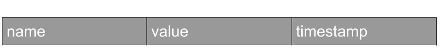
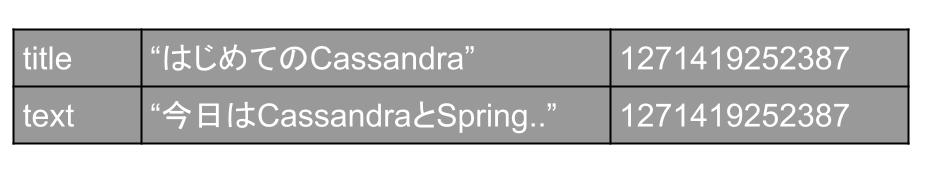
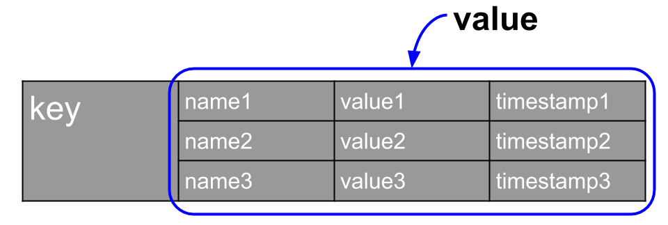
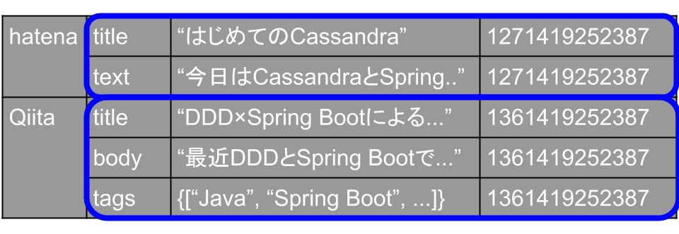
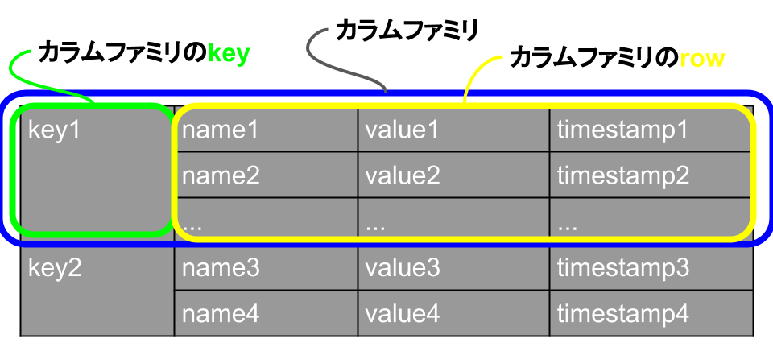
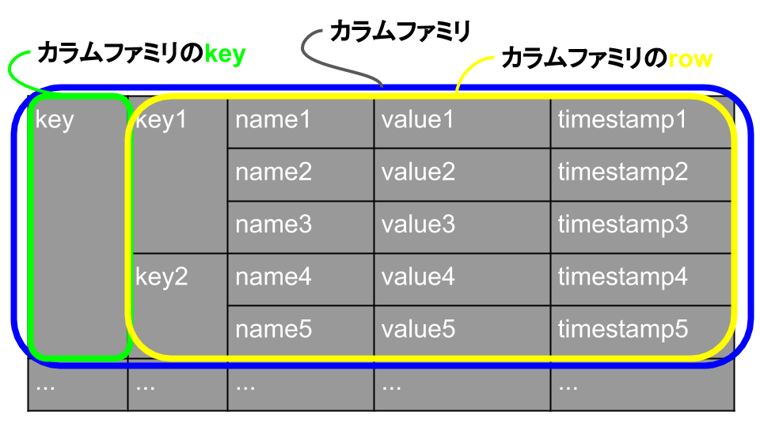
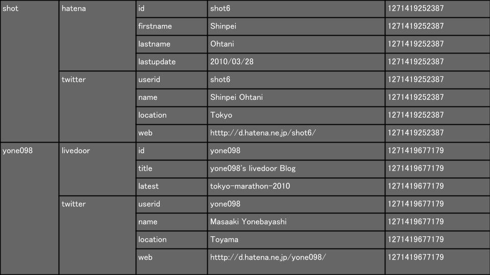
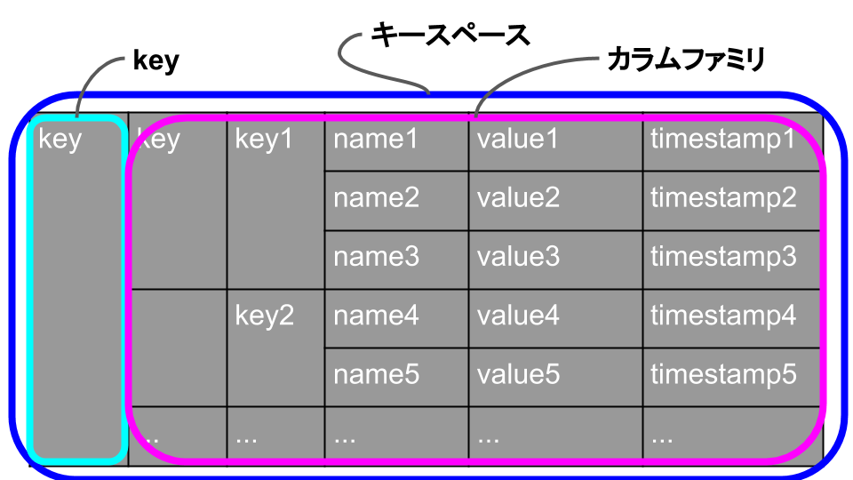

# データ構造
http://gihyo.jp/dev/serial/01/cassandra/0003

<!-- MarkdownTOC -->

- Cassandraのデータ構造
- カラム
    - データ構造
- スーパーカラム
    - データ構造
- カラムファミリ
    - データ構造
- キースペース

<!-- /MarkdownTOC -->

## Cassandraのデータ構造

## カラム
データ構造の最小単位

### データ構造

 - name：カラムにアクセスするためのキー
 - value：カラムの値
 - timestamp：カラムの更新日時

> 例) ブログサイトの場合
>
> 

## スーパーカラム
カラムの集合を扱うデータ構造。<strong style="color: red;">CQL for Cassandra 2.0では、スーパー・カラムが廃止されています</strong>

 - 複数のカラムを束ねて，1つのキーでアクセスできるようになります。
 - スーパーカラムのキーに対して，値が〈カラム名，カラム〉の，ソート済みのマップのようなデータ構造と思ってください。

### データ構造

 - key: このスーパーカラムにアクセスするためのキーです。
 - value: このスーパーカラムで保持するカラムの配列です。

> 例) ブログサイトの場合
>
> 

<strong style="color: red;">Cassandraではカラムファミリごとに異なるカラムを持つことができます。</strong>カラムは実行時に追加できるので，設定ファイルで決め打ちにしておく必要がありません。カラムの変更でCassandraのサーバを再起動しなくても済むのです。

## カラムファミリ
カラムまたはスーパーカラムの集合を扱う単位。RDBMSでいうところのテーブル

 - カラムの集合を**row**と呼ぶ
 - rowに**key**をつけて管理する

<strong>カラムファミリの特徴</strong> 
各カラムファミリはrowごとにソートされており，アクセスの単位も基本的にはこのカラムファミリのrowが基準になりアトミックになります。そのためアトミックに処理する関連カラムはすべてカラムファミリに落とし込む必要があります。

<strong>カラムファミリの設定</strong> 
カラムファミリは*storage-conf.xml*にて，たとえば「どういう名前でどういったカラム順序で保存しておくか」などを設定する必要があります。

<strong>カラムファミリ変更方法</strong> 
カラムファミリの変更を行った場合，現状のCassandraは再起動が必要になります。 
※Cassandra 0.7から動的なカラムファミリの変更をサポートするようです。

### データ構造
カラムを入れる場合 

スーパーカラムが入る場合 

> 例) ユーザIDごとに複数のWEBサービスのプロファイルを管理するカラムファミリ
>
> 

## キースペース
RDBMSでいうところのデータベース。一般に1アプリケーションで1つ使用する。

