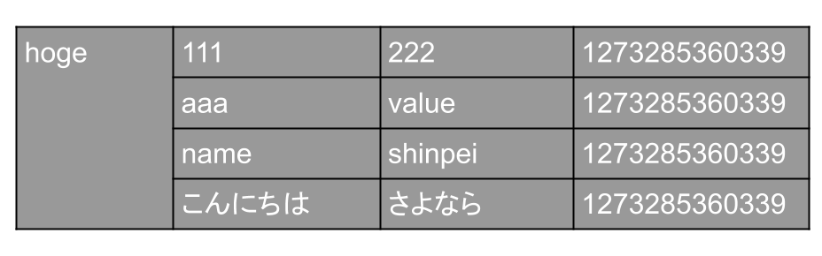
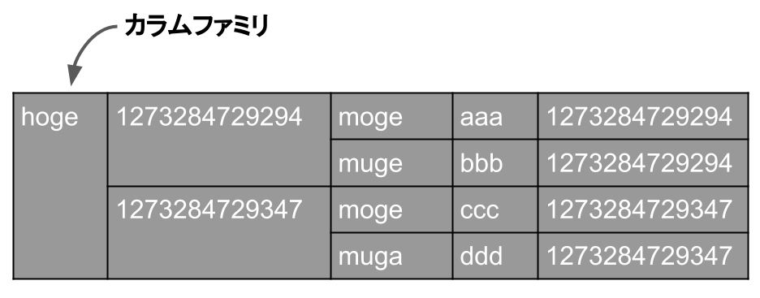

# 設定
http://gihyo.jp/dev/serial/01/cassandra/0004

## ①キースペース、カラムファミリの設定

```
<Keyspaces>
 <!-- キースペースは複数定義できる -->
 <!-- キースペースKeyspace1の定義 -->
 <Keyspace Name="Keyspace1">
   <!-- カラムファミリStandard1の定義 -->
   <ColumnFamily Name="Standard1" CompareWith="BytesType"/>

   <!-- カラムファミリSuper1の定義 -->
   <ColumnFamily Name="Super1" ColumnType="Super" CompareWith="BytesType" CompareSubcolumnsWith="BytesType" />
```

### `ColumnType`属性

 - カラムファミリ内にカラムが含まれる → `Standard`
 - カラムファミリ内にスーパーカラムが含まれる → `Super`

ColumnType属性に何も記載がないとStandardになる

### `CompareWith`属性
検索時のカラムのソートのための設定項目です。検索実行時にこのCompareWithで指定されたクラスを使ってカラムがソートされ，結果が返されます。

| CompareWith設定項目 | 説明 |
|:-------------------|:----|
| `BytesType` | byte[]で比較する。値の検証はしない。 |
| `UTF8Type` | UTF8でも文字列比較をする。 |
| `AsciiType` | byte[]での比較に加えてUS-ASCIIでのエンコードの検証をする。 |
| `LongType` | 64ビット長のlong値で比較する。 |
| `LexicalUUIDType` | 128ビット長UUIDのbyte[]値を比較する。 |
| `TimeUUIDType` | 128ビット長UUIDのタイムスタンプを比較する。 |

イメージとしては以下のようになります。



### `CompareSubcolumnsWith`属性（スーパーカラム内のカラムのソート）
CompareSubcolumnsWith属性は，スーパーカラムの場合（ColumnType="Super"）に使用します。それ以外のケースでは使えません。

スーパーカラムの場合，

 - スーパーカラムのソート → CompareWith
 - スーパーカラム内のカラムのソート → CompareSubcolumnsWith

という形で使い分けます。指定できる項目はCompareWithと同様です。

> 具体例を見てみましょう。
```
<ColumnFamily Name="time_utf8Order" ColumnType="Super" CompareWith="LongType" CompareSubcolumnsWith="UTF8Type"/>
```
> この例ではCompareWithに"LongType"，CompareSubcolumnsWithに"UTF8Type"を指定しているので，スーパーカラムはLong値でソートされ，スーパーカラム内のカラムはUTF8でソートされます。
>
> 以下のようなイメージになります。
>
> 


---
## ②コミットログとデータディレクトリを設定


---
## ③ノードを設定する


