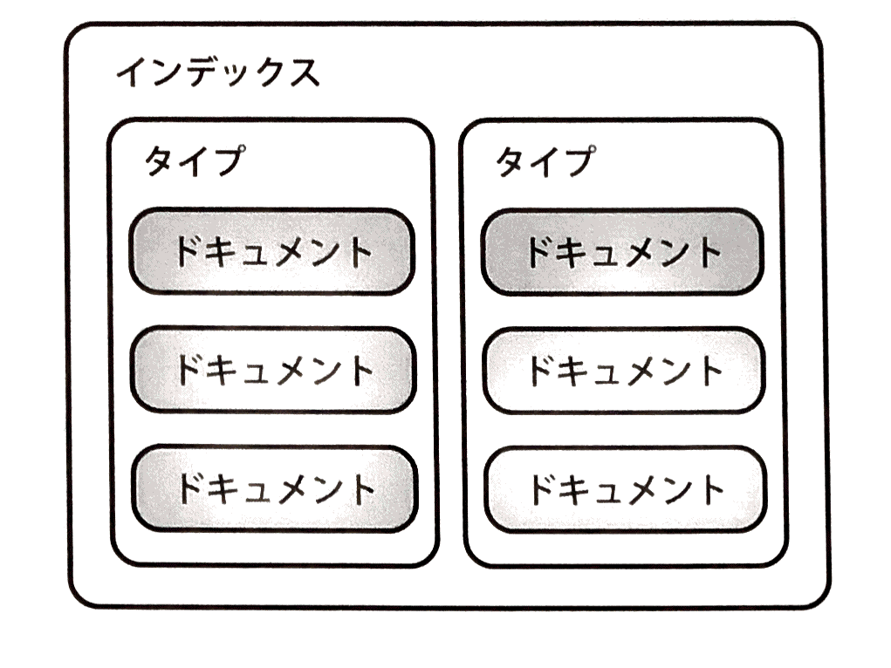
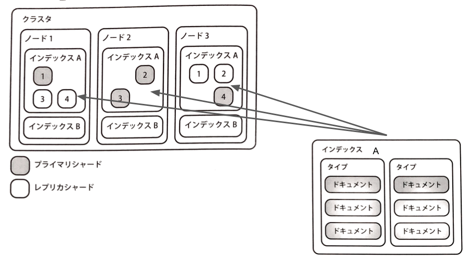

# Elasticsearchとは
> Elasticsearchとは、分散型全文検索サーバです。

## 特徴

 - OSS: GitHub上でオープンソースとして公開されており、修理の報告やパッチも簡単に作成できる。
 - ドキュメント指向: ドキュメント単位でフィールドの定義ができるため、柔軟なデータの登録ができる。
 - 分散システム: インデックスを分散して保持し、検索する。スケールアウトを当初から想定した設計
 - RESTfulなAPI: データの操作や設定・監視などの必要な機能がHTTPインターフェースで利用できる
 - (near)リアルタイム: データを(ほぼ)リアルタイムで検索できる

## アーキテクチャ

| 用語 | 説明 |
|:----:|:-----|
| **ノード** | Elasticsearchの1プロセスに相当します。同一のサーバ内で複数のノードを起動することもできます。ノードは個別の名前やIDにより識別できます。ノード名のデフォルトでは、UUID(*Universally Unique Identifier*)の先頭7文字が使用されます。 |
| **クラスタ** | Elasticsearchは複数のノードを１つのElasticsearchとして動作させることができます。このノード群のことをクラスタと呼びます。クラスタを構成することで、大量のデータを複数のノードに分散して保持できます。また、可用性や検索性能の向上のためにクラスタ内でレプリカを持つこともできます。クラスタへのデータの登録・検索は、これらのノードへのリクエストに変換され、各ノードで処理が実行されます。 クラスタを構成するには、各ノードに同一のクラスタ名を指定します。クラスタ名はデフォルトで"elasticsearch"です。 |

| 用語 | 説明 |
|:----:|:-------|
| **ドキュメント** | Elasticsearchで扱うデータの最小単位はドキュメントと呼ばれます。通常JSON形式のデータとなります。Elasticsearchはスキーマフリーであるため、各ドキュメントは異なった構造を乙ことができます。また、ドキュメントは複数のフィールドから構成され、共通する項目（フィールド）は同一の型を持つ必要があります。 |
| **フィールド** | RDBMSのカラムに相当します。フィールドごとに型(数値、文字列など)を指定できます。フィールドの設定は検索、表示に影響します。どのような検索がしたいのか、どのようにフィールドを利用するかを考えてデータを登録する必要があります。 |
| **インデックス** | インデックスはドキュメントの集合です。Elasticsearchは、基本的にインデックス単位でデータを管理しています。インデックスがクラスタのノードに分散して保持されることで、大量のデータを扱うことができます。 |
| **タイプ(インデックスタイプ)** | インデックスに登録するときにドキュメントを論理的に分類するための機能です。タイプを用いることで、インデックスに様々な種類のドキュメントを保存しても容易に管理できます。ドキュメントは、このタイプを**1つだけ**指定できます。Elasticsearchでも同様に**1インデックス1タイプ**を指定できます。 |

| 用語 | 説明 |
|:----:|:------|
| **シャード(セグメント)** | 小さな単位に分割したインデックスをシャードを呼びます。Elasticsearchはこのシャードをクラスタの各ノードに割り当てることで、データを分散させています。このシャードの数がデータを分散させることができる上限数です。１つのインデックスをいくつのシャードに分割するかという設定は、インデックス作成時にしかできないことに注意してください。 |
| **プライマリシャード/レプリカシャード** | シャードにはプライマリシャードとレプリカシャードがあります。Elasticsearchはデータ登録のリクエストがくると、プライマリシャードにデータを保存し、それからレプリカシャードにデータをコピーします。レプリカシャードはプライマリシャードのコピーです。|
