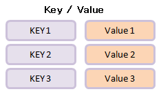
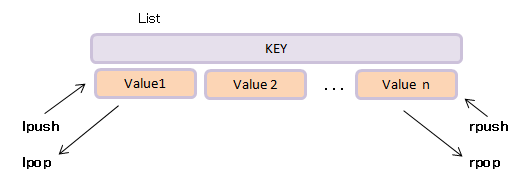
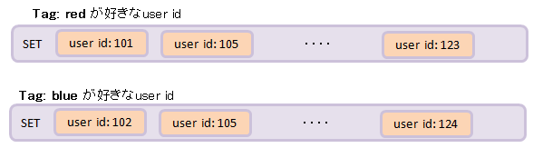

# インストール
```bash
# at Mac OS.
brew install redis
```
インストール後は、下記のようなコマンドが使える
```bash
/usr/local/bin/redis-server
/usr/localbin/redis-cli
```

# 起動・終了
**redis serverの起動**
```bash
$ redis-server
# 終了にはControl-C
```
**redis clientの起動**
```bash
$ redis-cli
```
**redis clientの終了**
```sql
> exit
-- 内容をdumpして終了
> shutdown
```
 - defaultでは、カレントディレクトリの`./dump.rdb`に保存される

---
# 基本的な操作
## データベースの選択

 - Redisのデータベースは、0,1,2,...のような整数値のindexを持っていて、これを用いてデータベースの切り替えを行う

```sql
> select INDEX
```
defaultでは`0`になっており、`1`を選択するのであれば、下記のようになる。
```sql
> select 1
ok
[1]>
```

## データの永続化
```sql
> bgsave  -- DBのフルダンプ(Redis DataBase, RDB)を作成
```

## データのSetとGet
```sql
-- データのSet
> set [KEY_NAME] [VALUE]

-- データのGet
> get [KEY_NAME]
```
例)
```sql
> set hoge hello
ok
> get hoge
"hello"
```

複数個のデータの束縛や取得
```sql
-- データのSet
> mset [KEY_NAME1] [VALUE1] [KEY_NAME2] [VALUE2]

-- データのGet
> mget [KEY_NAME1] [KEY_NAME2]
```
例)
```sql
> mset a 1 b 2 c 3
OK
> mget a b c
1) "1"
2) "2"
3) "3"
```

## Keyの表示
```sql
-- 全てのkeyを表示
> keys *
```

## Keyが存在するかを調べる
```sql
> exists [KEY_NAME]
```
例)
```sql
> set X 10
ok
> exists X
(integer) 1
> exists Y
(integer) 0
```

## keyの削除
```sql
del [KEY_NAME]
```

## データ型を調べる
```sql
> type [KEY_NAME]
```
例)
```sql
> set hoge hello
ok
> type hoge
string
```

---
# データ構造
## `String`
> <br>
> Set, Getで束縛、取得することができる基本的な型.<br>
> 数値文字の操作も可能.<br>
> 画像などもOK.
>
> - 応用場面
	- key/valueのキャッシュ用.
	- incrementとして使う. 例えば, Webページのヒット数などを保持したい場合.
> - 最大512MB

```sql

```sql
-- Increment（増加）
> incr KEY
> incrby KEY NUMBER

-- Decrement（減少）
> dicr KEY
> dicrby KEY NUMBER
```
例)
```sql
> set x 10
ok
> incr x
(integer) 11
> dicrby x 10
(integer) 1
```

## `List`
> <br>
> 順番の値の集合. 複数のキーと値の並び順を保持するデータ構造.
>
> - 応用場面
	1. 高頻度の追加処理,queueとして利用
	2. 時系列(追加順)に表示
	3. 追加された要素にアクセスが集中
> - 例: Twitterのタイムライン, ECサイトの現在購入タイムライン, 大量アクセスのqueue


```sql
-- 要素の追加
> lpush [KEY_NAME] [VALUE] -- 左(リストの先頭)から値を追加
> rpush [KEY_NAME] [VALUE] -- 右(リストの末尾)から値を追加

-- 要素の取り出し
> lpop [KEY_NAME] [VALUE] 
> rpop [KEY_NAME] [VALUE]

-- 要素の表示
> lrange [KEY_NAME] [START] [END] -- 表示したい区間の index (0, 1, 2, ...) を指定する

-- N番目の要素を表示
> lindex [KEY_NAME] N

-- N番目の要素を更新
> lset [KEY_NAME] [VALUE]

-- Listの長さを取得
> llen [KEY_NAME]

-- 任意の区間を取得
> ltrim [KEY_NAME] [START] [END]
```
例)
```sql
> rpush list 1
(integer) 1
> rpush list 2
(integer) 2
> lpush list 0
(integer) 3
> lrange list 0 -1
1) "0"
2) "1"
3) "2"
> lset list 1 New
ok
> lrange list 0 -1
1) "0"
2) "New"
3) "2"
```

## `Set`
> <br>
> 要素の集合.<br>
> 値の重複を許さない要素の集合.
>
> - 応用場面 : タグ検索機能
> - 例 : 積の集合 SINTER tag:red tag:blue

**要素の追加・削除**
```sql
> sadd [KEY_NAME] [VALUE]  -- 追加
> srem [KEY_NAME] [VALUE]  -- 削除
```
**要素の表示**
```sql
> smembers [KEY_NAME]
```
**和集合**
```sql
> sunion [KEY_NAME1] [KEY_NAME2]
```
**積集合**
```sql
> sinter [KEY_NAME1] [KEY_NAME2]
```
**差集合**
```sql
> sdiff [KEY_NAME1] [KEY_NAME2]
```
例)
```sql
> sadd seta a
> sadd seta b
> sadd setb c
> sunion seta setb
1) "a"
2) "c"
3) "b"
```


## `Sorted Set`
> ソート済みのセット. 各メンバがScoreで順序付けされる.
> 
> - 応用場面 : ランキング(PV数やコメント数順)

**要素の追加・削除**
```sql
> zadd [KEY_NAME] [SCORE] [MEMBER] -- 追加
> zrem [KEY_NAME] [SCORE] [MEMBER] -- 削除
```

**要素の表示**
```sql
> zrange [KEY_NAME] START END    -- 昇順
> zrevrange [KEY_NAME] START END -- 降順 
```

例)
```sql
> zadd bar 20 ham
(integer) 1
> zadd bar 10 egg
(integer) 1
> zadd bar 30 spam
(integer) 1
> zrange bar 0 -1
```


## `Hash`
> <br>
> Key-Value の辞書型.<br>
> 
> - 応用場面 : ユーザの名前と年齢と誕生日であれば
	- ユーザ(Key).名前(Field)=Aさん(value)
	- ユーザ(Key).年齢(Field)=35(value)
	- ユーザ(Key).誕生日(Field)=19950621(value)

**要素の束縛**
```sql
hset KEY FIELD VALUE
```
**要素の取得**
```sql
hget KEY FIELD
```
例)
```sql
-- hmset, hmgetで一括の束縛と取得が可能
> hmset dic a hoge b fuga
> hget dic a
"hoge"
```