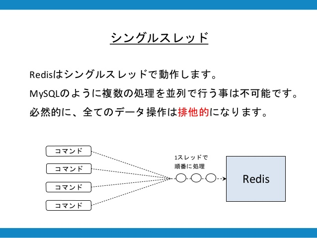
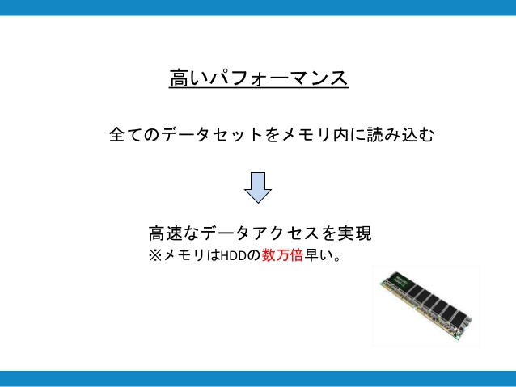
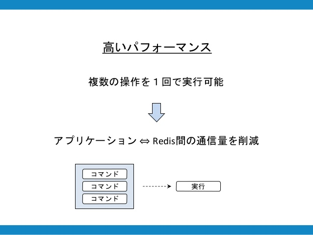

# Redisとは？

 
 - Key-Value型のNoSQL
 	- Key-Valueとは？ : 
 - `In Memory`であるため、データ容量に対する制限はあるものの非常に高速に動作する
 	- `In Memory`とは？ : コンピュータのメインメモリ上のみでデータを管理する仕組み
 	- どのくらい速いの？ → https://ameblo.jp/principia-ca/entry-11197286812.html
 - 「Remote dictionary server」から名前が付けられた

## 特徴

| 特徴項目 | 説明 |
|:--------:|:-----------|
| **シングルスレッド**  | シングルスレッドで動作する. MySQLのように複数の処理を並列で行うことは不可能. 必然的に、全てのデータ操作は**排他的**になる |
| **高いパフォーマンス**  | 全てのデータセットをメモリ内に読み込む →高速なデータアクセスを実現 ※メモリはHDDの**数万倍**速い. |
| **高いパフォーマンス②**  | 複数の操作を1回で実行可能 →アプリケーション<=>Redis間の通信量を削減 |
| **データ構造が多彩** | String/List/Set/Sorted Set/Hash |

## メモリを使い果たした場合

 - 特定のルールに従って削除される
 	- LRUアルゴリズムなど5つのパターンから設定可能
 - それでもメモリを確保できないときは、書き込みが全てエラーになる

# 利用シーン・使用例

 - [redis、それは危険なほどのスピード | サイバーエージェント 公式エンジニアブログ](https://ameblo.jp/principia-ca/entry-11197286812.html)
 - [RDBMSの苦手な処理をカバーする、気の利いたNoSQL「Redis」 - (page 2) - ZDNet Japan](https://japan.zdnet.com/article/35063104/2/)